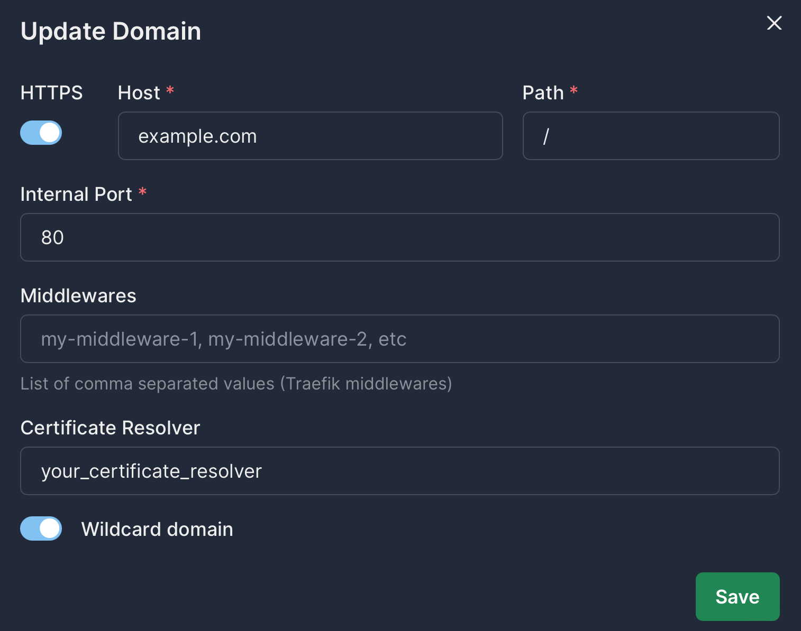

# Setting Up a Wildcard Domain

In this guide, we'll walk you through the process of configuring a wildcard domain in Easypanel. Follow these steps to successfully set up your wildcard domain.

## Step 1 - Create a Certificate Resolver

Open the Traefik environment editor from settings inside Easypanel.

:::info
Replace `<PROVIDER_NAME>` with your desired provider's name.
:::

```env
TRAEFIK_CERTIFICATESRESOLVERS_<PROVIDER_NAME>_ACME_EMAIL=
TRAEFIK_CERTIFICATESRESOLVERS_<PROVIDER_NAME>_ACME_STORAGE=
TRAEFIK_CERTIFICATESRESOLVERS_<PROVIDER_NAME>_ACME_DNSCHALLENGE_PROVIDER=
TRAEFIK_CERTIFICATESRESOLVERS_<PROVIDER_NAME>_ACME_DNSCHALLENGE_RESOLVERS=1.1.1.1,8.8.8.8
```

## Step 2 - Set Credentials for Your Provider

See available providers on the [Official Traefik Documentation](https://doc.traefik.io/traefik/https/acme/#dnschallenge) and set your credentials in the Traefik environment.

## Step 3 - Create Your Wildcard Domain

Go to your service domains page inside your Easypanel instance and click "Add Domain". Make sure to put the same certificate resolver as set in env under `TRAEFIK_CERTIFICATESRESOLVERS_<PROVIDER_NAME>_ACME_DNSCHALLENGE_PROVIDER`.

:::caution
**If you activate the Wildcard domain option**, only **\*.example.com** will point to your service. To have both **example.com** and **\*.example.com** point to your service, you need to create **2 separate domains**.
:::



## Conclusion

Following the steps outlined in this guide, you can easily set up a Wildcard Domain on Easypanel. If you have any questions or need further assistance, feel free to reach out to us on our Discord channel.
